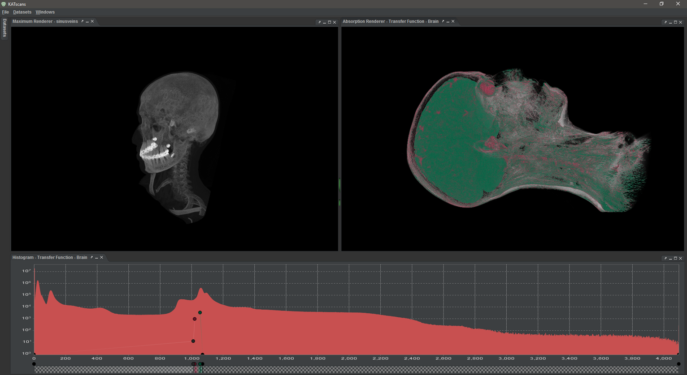
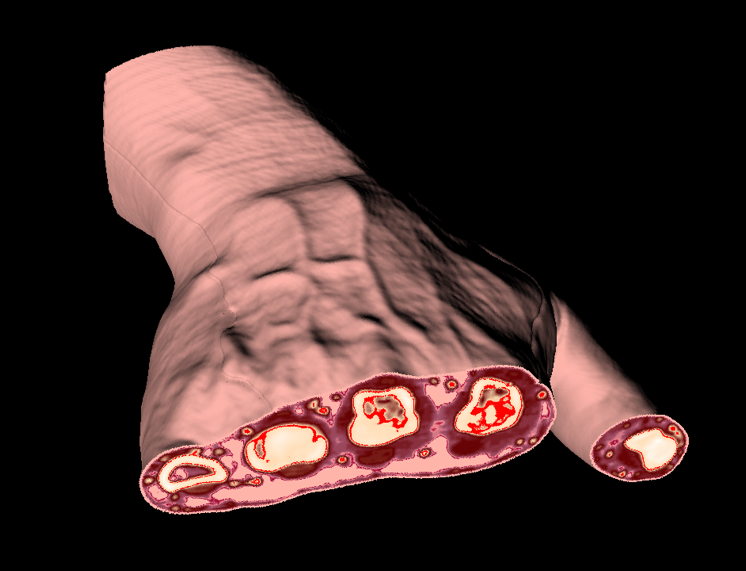
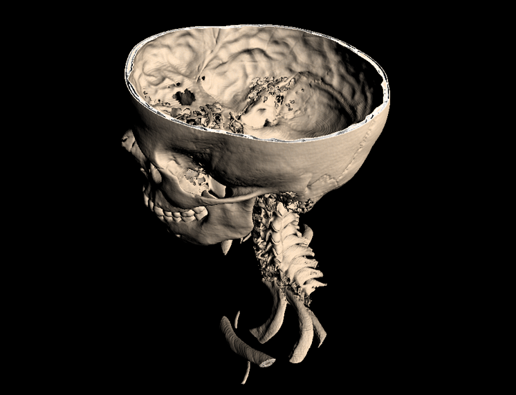
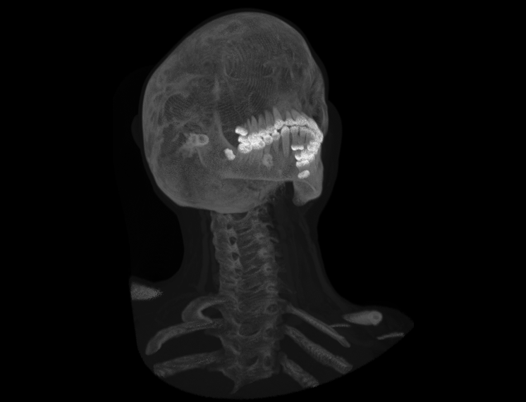
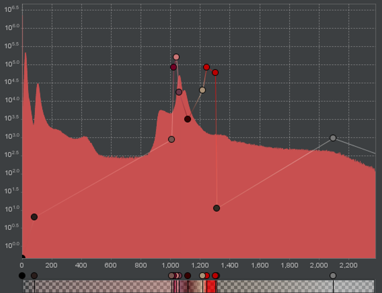

#### A Java OpenGL volume renderer

KAT scans handles and load DAT, DCM, GRID, and RAW formats for volume rendering.


###### It includes several volume raycasting/raymarching renderers. A few examples:




###### With easy to use interface. Like the transfer function editor:


### Controls
|Action                          |Component         |Description                        |
|--------------------------------|------------------|-----------------------------------|
|`CTRL` + `1`                    |General           |Open Datasets panel                |
|`?`                             |General           |Show help dialog                   |
|`Space`                         |Dataset tree      |Display selected node actions      |
|`Right button`                  |Dataset tree      |Display selected node actions      |
|Scroll                          |Camera            |Zoom                               |
|`Middle button` + drag          |Camera            |Zoom                               |
|`Left button` + drag            |Camera            |Rotate                             |
|`Right button` + drag           |Camera            |Pan                                |
|`ALT` + scroll                  |Camera            |Field of view                      |
|`ALT` + drag                    |Camera            |Field of view                      |
|`SHIFT` + drag                  |Camera            |Light position                     |
|`SHIFT` + scroll                |Slice             |Slice through volume               |
|`SHIFT` + `Middle button` + drag|Slice             |Slice through volume               |
|`X` + `Left button` + drag      |Slice             |Upper slice cut on X axis          |
|`X` + `Right button` + drag     |Slice             |Lower slice cut on X axis          |
|`X` + `Middle button` + drag    |Slice             |Upper and lower slice cut on X axis|
|`Y` + `Left button` + drag      |Slice             |Upper slice cut on Y axis          |
|`Y` + `Right button` + drag     |Slice             |Lower slice cut on Y axis          |
|`Y` + `Middle button` + drag    |Slice             |Upper and lower slice cut on Y axis|
|`Z` + `Left button` + drag      |Slice             |Upper slice cut on Z axis          |
|`Z` + `Right button` + drag     |Slice             |Lower slice cut on Z axis          |
|`Z` + `Middle button` + drag    |Slice             |Upper and lower slice cut on Z axis|
|`CTRL` + `Left button` + drag   |Surface renderer  |Upper cut-off threshold            |
|`CTRL` + `Right button` + drag  |Surface renderer  |Lower cut-off threshold            |
|`CTRL` + `Middle button` + drag |Surface renderer  |Upper and lower cut-off threshold  |
|`ALT` + `Left button` + drag    |Composite renderer|Stride length                      |
|`Left button` + drag right      |Transfer function |Zoom histogram                     |
|`Left button` + drag left       |Transfer function |Reset histogram zoom               |
|`Right button`                  |Transfer function |Transfer function node color picker|
|`Middle button`                 |Transfer function |Delete transfer function node      |

### Compiling
#### Requirements
* Java JDK 8
* Java Swing
  * Note that Swing is being deprecated. Recommended JDK version is 11
* Maven
* OpenGL
  * Note the deprecation of OpenGL in certain platforms. If running on MacOS, `jogl-2.4` is required

#### Compiling
```bash
$ maven package
```

#### Executing
To execute straight from maven:
```bash
$ maven process-classes antrun:run org.codehaus.mojo:exec-maven-plugin:1.2.1:exec
```
To execute after build:
```bash
$ maven package
$ java -jar ./target/KATscans-jar-with-dependencies.jar
```
